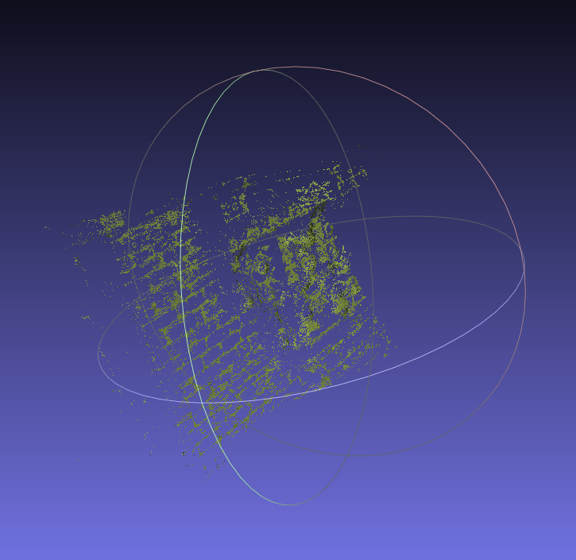
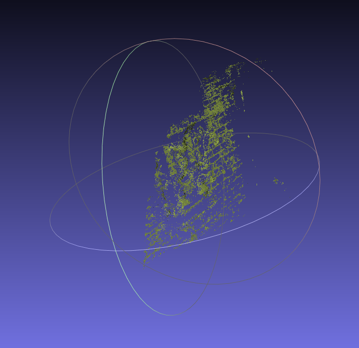
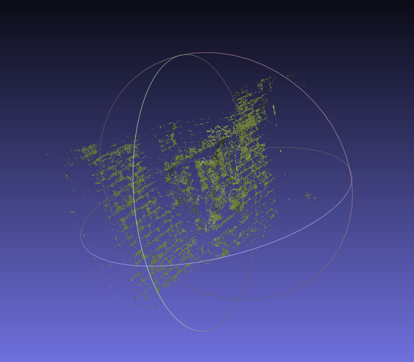

# Performace (usecase):
fountain_a | fountain_b | a+b
:-: | :-: | :-:
 |  | 

original data is well-aligned, so we have to distort it.
fountain_a (pointcloud P) was:
* distorted with gaussian noise and 
* rotated 20 ْ around (0,1,0)

## Icp results
robust Icp | Trimmed Icp
:-: | :-:
 | 

Note that the robust icp takes more iteration to obtain more accurate alignment with mse~=0.02, but with less points satisfying the geometric criterion than the trimmed points used in computation in the trimmed icp.

The trimmed icp converges very fast, thus changes in mse become small so it stops.
